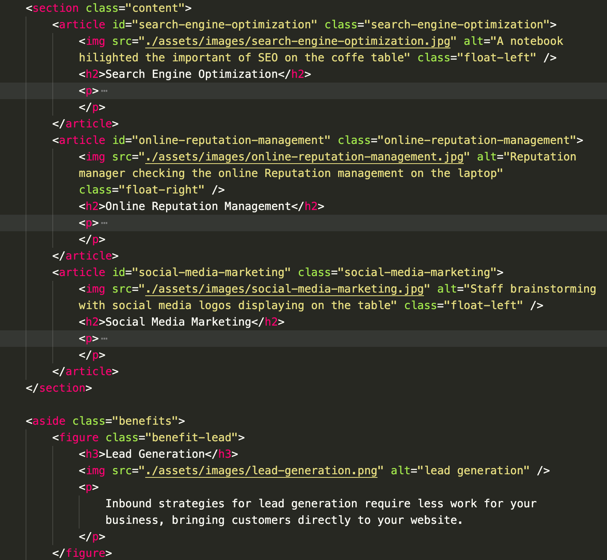
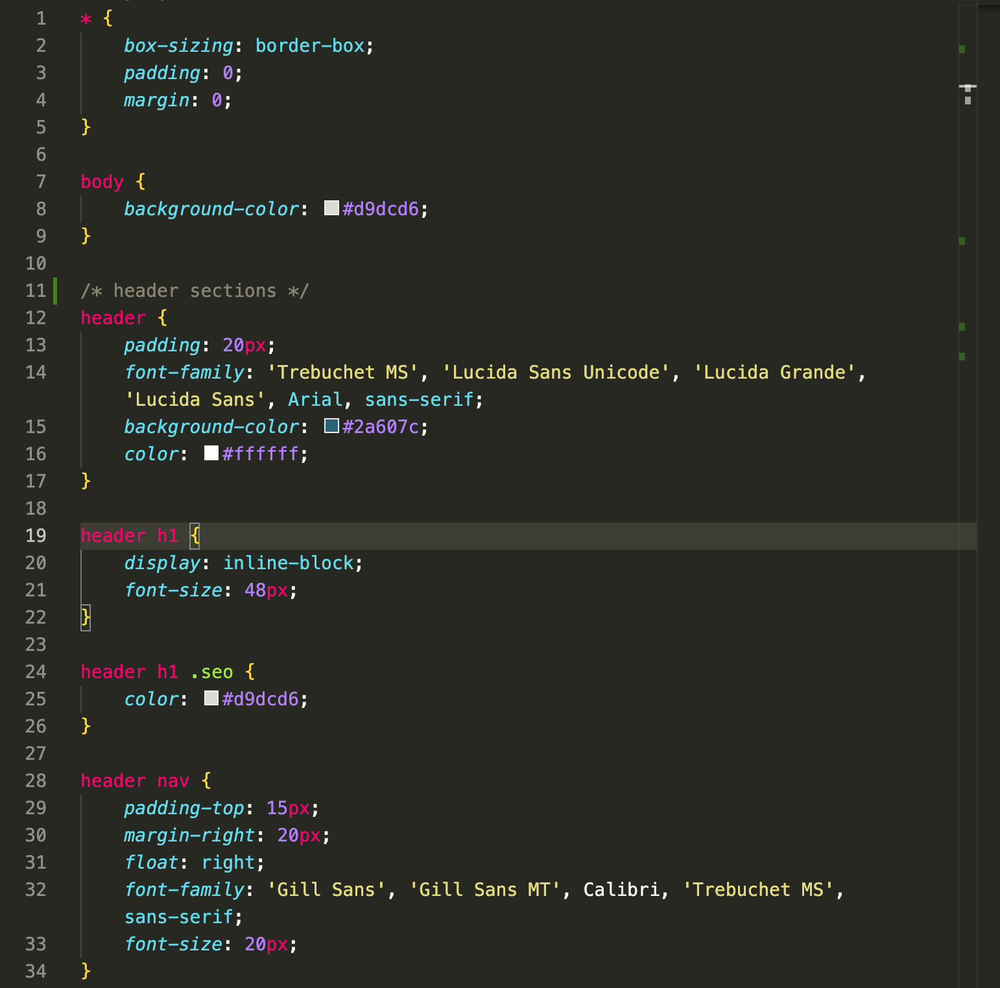

# horiseon-refactor-project
Refactor code to ensure web accessibility. 

## Table of Contents
1. [Description](#description)
2. [Visuals](#visuals)
3. [Website link](#website-link)


## Description
 
Web accessibility helps increase the traffic to your website. By making sure we use the right structure for the html, correct semantic elements, providing concise and descriptive title. Also making sure that everything is working properly i.e, interal and external links. 

## Visuals

```bash
Example of html semantics
```




```bash
Example of css selectors and properties
```


## Website link
### [Horiseon](https://sasimapatterson.github.io/horiseon-refactor-project/)